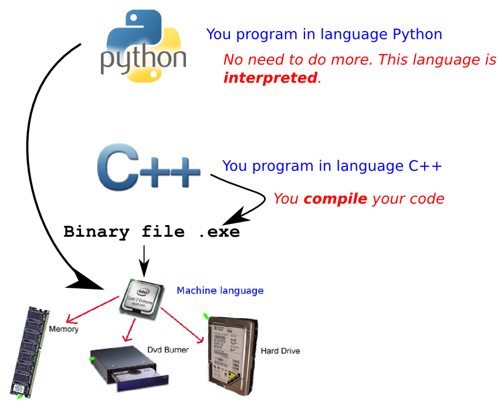
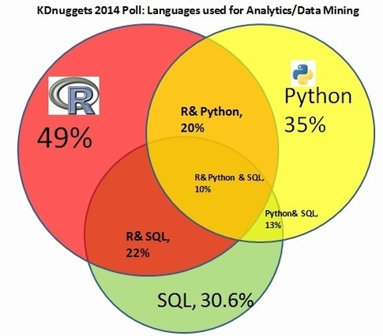

# Introduction of Python

(Carlos Peña)

## Overview
* [Presentation of Python](#presentation-of-python)
* Installation of Python
* [Resources](#resources)
* Basics of Python
* Modulable code
* Using an existing library
* End of the course: complete script/package

Setup virtualenvwrapper in Mac:
    http://mkelsey.com/2013/04/30/how-i-setup-virtualenv-and-virtualenvwrapper-on-my-mac/
    

## Presentation of Python
#### There are many programming languages nowadays.

   

---
#### Programming languages for all needs, tastes and categories.

   

---
#### Popularity of Python.

    
Source <http://blog.codeeval.com/codeevalblog/2015>

---
#### Popularity of Python versus R in data science:

    
---
#### Python is a language used for a wide variety of purposes:

* Awesome Python <https://github.com/vinta/awesome-python>

---
#### Let's choose Python for this workshop:

    
* Python is language with a precise, simple and efficient syntax.
* Thus, it is easy to write, read and understand code.
* Python has libraries for statistic analysisa and plotting of data,
  comparable to those in R:  **NumPy, matplotlib and SciPy**.
* There are popular toolkits for bioinformatics such as BioPython.

## Resources
* [Uncle Bob](https://www.youtube.com/watch?v=Ai2nZIobM3o)
* [Big data Borat](https://twitter.com/bigdataborat/status/355511037124030466)
* <http://swcarpentry.github.io/python-novice-inflammation/>
