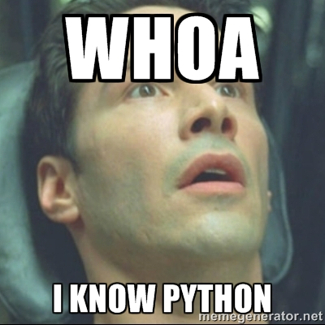
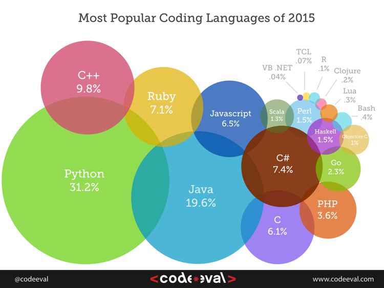
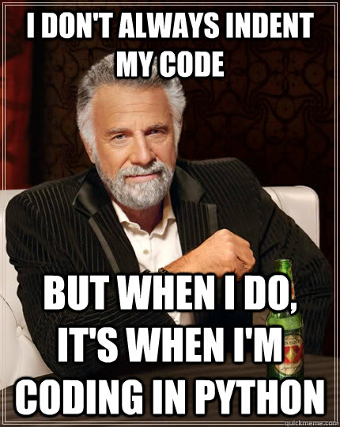

# Introduction of Python

(Carlos Peña)


## Overview
* [Presentation of Python](#presentation-of-python)
* [Resources](#resources)
* [Installation of Python](#installation-of-python)
* [Basics of Python](#basics-of-python)
* [Modulable code](#modulable-code)
* Using an existing library
* End of the course: complete script/package



    

## Presentation of Python
## There are many programming languages nowadays.

   

## Programming languages for all needs, tastes and categories.

   

## Popularity of Python.


    
Source <http://blog.codeeval.com/codeevalblog/2015>

## Popularity of Python versus R in data science:


    
## Python is a language used for a wide variety of purposes:

* Awesome Python <https://github.com/vinta/awesome-python>

## Let's choose Python for this workshop:


    
* Python is language with a precise, simple and efficient syntax.
* Thus, it is easy to write, read and understand code.
* Python has libraries for statistic analysisa and plotting of data,
  comparable to those in R:  **NumPy, matplotlib and SciPy**.
* There are popular toolkits for bioinformatics such as BioPython.


## Resources
* [Uncle Bob](https://www.youtube.com/watch?v=Ai2nZIobM3o)
* [Big data Borat](https://twitter.com/bigdataborat/status/355511037124030466)
* [Python documentation](https://www.python.org/doc/)
* If you get stuck, [Stackoverflow](http://stackoverflow.com/) might be of help.
* <http://swcarpentry.github.io/python-novice-inflammation/>

## Installation of Python
* Python2 versus Python3. To install, or not to install, that is the question. 
  Let's install Python 3.4.3 <https://www.python.org/downloads/release/python-343/>
  
* Install IPython:

```shell
sudo easy_install pip
sudo pip install ipython
```

## Basics of Python
* We will do some exercises before writing *real code*. Fire up IPython from 
your command line:

```shell
ipython
```

```ipython
Python 3.3.2+ (default, Feb 28 2014, 00:52:16) 
Type "copyright", "credits" or "license" for more information.

IPython 2.3.1 -- An enhanced Interactive Python.
?         -> Introduction and overview of IPython's features.
%quickref -> Quick reference.
help      -> Python's own help system.
object?   -> Details about 'object', use 'object??' for extra details.

In [1]: 
```

* Explore variables, strings, integers, floats, lists, dictionaries.
* Explore operations **+, -, \*, /, +=, -=**
* Explore conditionals: **if...else**
* Explore loops: **for, while**
* Explore booleans: True, False, None, and boolean operations **and, or, not**.
* Explore comparisons: **<, <=, >=, ==, !=, is, is not**
* Comments and docstrings.
* Operations on strings, integers, lists, list indexes, concatenation, etc.

## Modulable code
* Imagine you need to run a series of instructions in Python code many times.
  Imagine that your colleague would like to run this code. 
  **You should write modular code**.
* Writing modular code involves several steps.

### Functions


* Indenting.
* Name your variables with :heart:
* Python gurus say that a **function** is an *object* that can accept arguments
  and possible return another *object*.
* I say that a **function** is a series of **instructions** designed to do only
  one thing. And it should do it lovely.
  
```python
def my_cool_function_name(argument1, argument2):
    # do cool stuf with my two arguments
    # if you want to return somenthing, use the keyword return
```

* Task 1: write a function that performs the complement of three nucleotides
  of DNA, a codon:
    * Input is a codon sequence: **ATG**
    * Output is the reverse complement: **TAC**

* Task 2: write a function that performs the complement of a long DNA
  sequence:
    * Input is a sequence: **ATGAAAATCCCGGTAAAACCT**
    * Output is the reverse complement: **TACTTTTAGGGCCATTTTGGA**
    
### Modules
* Python gurus say that a **module** is a simple way to structure your Python 
  code.
* Modules can be files with python code, or folder with several files with python
  code.
* A crucial benefit of organizing your code this way is that modules can borrow
  python code by importing each other. Modules import modules.
