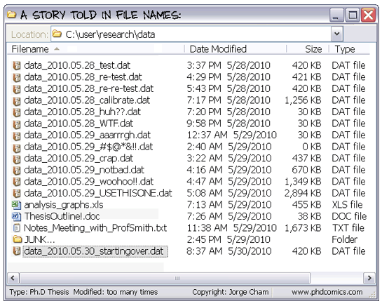

# Version control with Git

(Matthieu Bruneaux)

## Overview

- Introduction to version control
- Setting up and using Git
- Basic Git usage
- Setting up a remote repository for collaborative work
- Cloning, pushing and pulling
- Workflow example for a single developer

## Introduction to version control

### What is version control?

- Some common issues arise when files are not version-controlled:

  

- This happens not only for data, but for scripts also... How can we do it better?

### Reproducibility of research?

- Research should be reproducible by others.
- This refers to the experiments generating the data, but also to the analysis
  of the data.
- The first researcher who will need to reproduce your results is likely to be
  **you**.

### Reproducibility of analyses

- Lab books make lab work traceable. Analyses should also be traceable.
- Analysis steps must be recorded, and reverting to any previous step must be
  possible.
- This ensures that we always exactly know how a result was generated.

### Version control

- Version control is a tool to keep track of file changes.
- However, version control softwares offer more than simply recording
  successive versions of a file.
- Version controlled projects can be forked, merged and shared with
  collaborators.

### Example of a version control flow for a Python script

- **V1**, **V2**, and **V3** are successive versions of the script
- **V4** is committed, but then a mistake is found. We revert to **V3**
- A new, correct **V4** is committed
- **V5** and **V6** are successive versions of the script
- At this point, we want to implement a new feature that might be interesting,
  but which is experimental. In order to keep **V6** clean, we create a new
  branch in which we can experiment with the script without damaging the stable
  **V6**
- **V6b** and **V7b** are successive versions of the experimental script
- At some point, the experimental changes are mature and we want to merge them
  back into the master branch. **V7b** and **V6** are merged together into **V8**
- We realise we want to revert to a previous version of one function in the
  script. For this function, we revert to the code present in **V2**, and commit it
  as **V9**
- **V10** is the next commit

- How version control works: history, branches, merging
- Interest of version control for collaborative work and for single developper
  (the single developper case will be developped in more details later)

### What are the available tools?

- Tools: SVN, **Git**
- Online servers for repositories: GitHub and BitBucket, differences between
  the two

## Installing and setting up Git

### Git installation

- Install Git

### Git basic setup

- Set up the PATH for accessing it from the command line
- Set up the user name and email

## Basic Git usage

### Adding files and committing changes

- First commit
- Second commit
- Git log and graphical interfaces

### Diff and reverting to previous versions

- Diff between files
- How to revert to a previous version

### Branching and merging

- Branching and merging
- Resolving merge conflicts

## Setting up and using remote repositories

### Creating a new remote repository

- Set up a GitHub account
- Create a new repository

### Pushing to the remote repository

- Push to the new repository

## Cloning an existing project

- Clone a project prepared by the teachers
- Modify the code and send a pull request

## Going further: workflow example for single developper

## Resources

links go here
